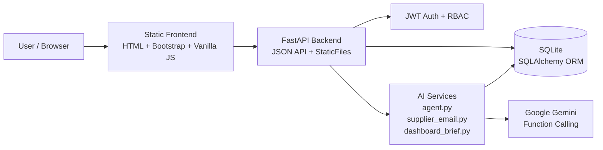
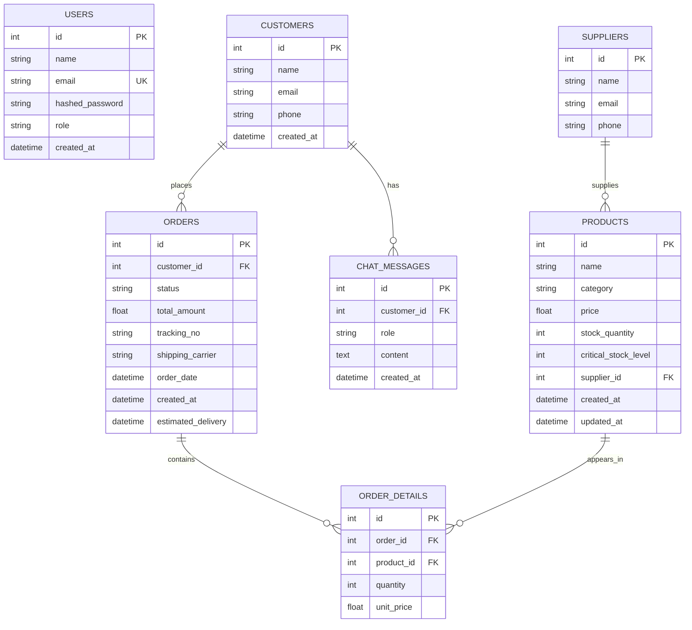
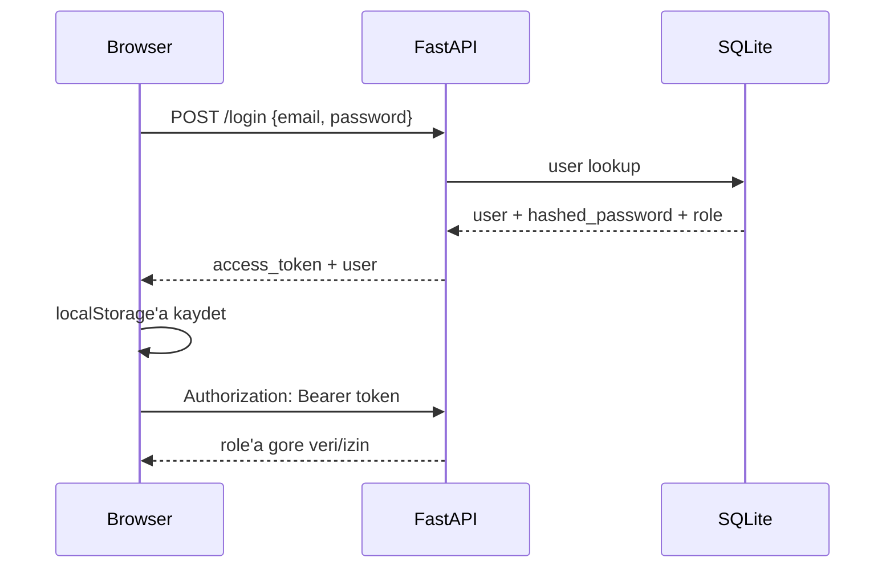
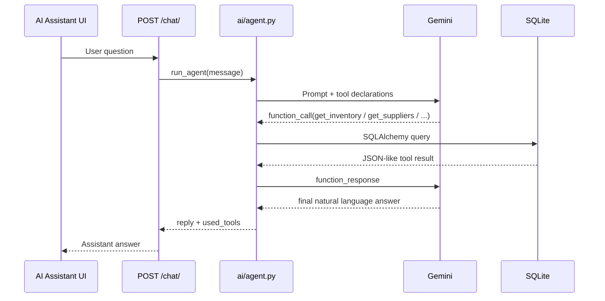

# SME E-Commerce AI Assistant

KOBI'ler icin gelistirilmis yapay zeka destekli e-ticaret operasyon yonetim sistemi. Proje; urun, siparis, stok, tedarikci ve gunluk is ozeti akislari uzerinden kucuk isletmelerin operasyon takibini kolaylastirir. AI katmani Gemini function calling kullanarak veritabanindan gercek verileri okur ve kullaniciya dogal dilde cevap uretir.

## Cozulen Problem Alanlari

Hackathon kapsaminda uc ana alana odaklanildi:

| Alan | Projedeki karsiligi |
|---|---|
| Musteri iletisimi ve operasyon asistanligi | AI Assistant, Gemini function calling, DB tabanli tool'lar |
| Urun ve siparis takibi | Products, Orders, Dashboard, kargo/status guncelleme |
| Stok ve tedarikci yonetimi | Inventory kritik stok takibi, supplier yonetimi, tedarikci mail taslagi |

## Temel Ozellikler

- JWT tabanli login/register akisi.
- Admin, Business Owner, Sales Manager ve Inventory Staff rolleri.
- Role gore frontend buton gizleme ve backend `require_roles(...)` kontrolu.
- Urun listeleme, ekleme, guncelleme ve silme.
- Siparis ekleme, durum/kargo bilgisi guncelleme, iptal ve silme.
- Siparis olusturulunca stok dusme; iptal/silme akislariyla stok geri yukleme.
- Inventory ekraninda kritik stok tespiti.
- Kritik stok urunleri icin supplier email draft uretimi.
- Supplier listeleme, ekleme, guncelleme, silme ve urun baglama.
- Dashboard metrikleri ve AI/kural tabanli gunluk ozet.
- AI Assistant ile orders/products/inventory/suppliers/dashboard verileri uzerinden soru-cevap.

## Mimari



## Klasor Yapisi

```text
HackathonProject/
|-- ai/
|   |-- agent.py              # AI Assistant + Gemini function calling
|   |-- dashboard_brief.py    # Dashboard icin AI/kural tabanli ozet
|   `-- supplier_email.py     # Kritik stok icin mail taslagi
|-- backend/
|   |-- main.py               # FastAPI app, CORS, static frontend mount
|   |-- database.py           # SQLite engine ve DB dependency
|   |-- models.py             # SQLAlchemy tablolar
|   |-- schemas.py            # Pydantic request/response modelleri
|   |-- seed.py               # Demo verisi
|   |-- smb_app.db            # SQLite demo database
|   `-- routers/
|       |-- auth.py
|       |-- products.py
|       |-- orders.py
|       |-- inventory.py
|       |-- suppliers.py
|       |-- dashboard.py
|       `-- chat.py
|-- frontend/
|   |-- index.html
|   |-- login.html
|   |-- register.html
|   |-- dashboard.html
|   |-- products.html
|   |-- add-product.html
|   |-- orders.html
|   |-- add-order.html
|   |-- inventory.html
|   |-- suppliers.html
|   |-- add-supplier.html
|   |-- ai-assistant.html
|   |-- css/style.css
|   `-- js/script.js
|-- requirements.txt
|-- .env.example
`-- README.md
```

## ER Diyagrami



Not: Ayrica fiziksel bir `inventory` tablosu yoktur. Inventory ekrani `products.stock_quantity` ve `products.critical_stock_level` alanlarindan turetilen bir view gibi calisir.

## Veri Modeli Mantigi

| Tablo | Amac |
|---|---|
| `users` | Sisteme giris yapan personel ve rol bilgisi |
| `customers` | Siparis veren musteriler |
| `suppliers` | Tedarikci iletisim bilgileri |
| `products` | Urun katalogu, fiyat, stok ve kritik stok seviyesi |
| `orders` | Siparis ust bilgisi, durum ve kargo bilgisi |
| `order_details` | Siparisteki urun, adet ve birim fiyat |
| `chat_messages` | Customer ID verilirse AI sohbet gecmisi |

## Auth ve RBAC

Login akisi:



Token suresi 60 dakikadir. Token gecersiz veya expired olursa frontend localStorage'i temizler ve kullaniciyi login sayfasina yonlendirir.

### Rol Matrisi

| Islem | Admin | Business Owner | Sales Manager | Inventory Staff |
|---|:-:|:-:|:-:|:-:|
| Genel okuma endpointleri | OK | OK | OK | OK |
| User listeleme | OK | OK | - | - |
| User silme | OK | - | - | - |
| Product ekleme/guncelleme/silme | OK | OK | - | - |
| Order ekleme/guncelleme/iptal/silme | OK | OK | OK | - |
| Inventory guncelleme | OK | OK | - | OK |
| Draft supplier email | OK | OK | - | OK |
| Supplier ekleme/guncelleme/silme | OK | OK | - | - |

## AI Entegrasyonu

`ai/` klasoru uc servis icerir:

| Servis | AI_ENABLED=true | AI_ENABLED=false veya hata |
|---|---|---|
| `agent.py` | Gemini function calling ile DB tool'larini kullanir | Placeholder veya quota fallback mesaji |
| `supplier_email.py` | Gemini ile profesyonel mail taslagi uretir | Guvenli sablon mail taslagi |
| `dashboard_brief.py` | Gemini ile dogal dilde dashboard ozeti uretir | Kural tabanli ozet |

### AI Assistant Tool'lari

`ai/agent.py` Gemini'ye su tool'lari sunar:

| Tool | Veri kaynagi | Cevaplayabildigi ornek sorular |
|---|---|---|
| `get_orders` | `orders`, `order_details`, `products`, `customers` | "What is the status of order #1?" |
| `get_products` | `products` | "What is our most expensive product?" |
| `get_inventory` | `products` | "Which products are low in stock?" |
| `get_suppliers` | `suppliers`, `products` | "Which suppliers do we have?", "What are supplier phone numbers?" |
| `get_dashboard` | aggregate DB queries | "Give me today's business summary." |

Function calling akisi:



Quota/high demand durumunda Gemini hata verebilir. Proje bu durumda 500 ile kirilmaz; dashboard ve supplier email servisleri fallback kullanir, AI Assistant ise kullaniciya servis gecici olarak kullanilamiyor mesajini dondurur.

## Kritik Is Akslari

### Product

1. Admin veya Business Owner login olur.
2. Products sayfasinda urunler listelenir.
3. Add Product ile yeni urun eklenir.
4. Update/Delete islemleri yalniz yetkili roller icin gorunur.

### Order

1. Admin, Business Owner veya Sales Manager siparis ekler.
2. Siparis `Cancelled` degilse urun stogu azalir.
3. Status, tracking number ve carrier update modalindan guncellenir.
4. Siparis iptal edilirse stok geri yuklenir.

### Inventory

1. `GET /inventory` product tablosundan turetilmis stok listesini dondurur.
2. `current_stock <= critical_level` ise urun kritik kabul edilir.
3. Yetkili rol icin Draft Email butonu gorunur.
4. Draft Email endpoint'i supplier bilgisiyle mail taslagi uretir.
5. Frontend modalinda taslak gosterilir ve `Open Email` butonu mail uygulamasina aktarir.

### Supplier

1. Suppliers sayfasi tedarikci listesini ve bagli urunleri gosterir.
2. Add Supplier sayfasinda tedarikci iletisim bilgileri ve bagli urunler secilir.
3. Update modalinda email, phone ve urun baglantilari guncellenir.
4. Delete islemi tedarikciyi silmeden once urunlerin `supplier_id` alanini bosaltir.

## Hizli Baslangic

```powershell
cd C:\Users\onura\PycharmProjects\HackathonProject

python -m venv .venv
.\.venv\Scripts\Activate.ps1
pip install -r requirements.txt

copy .env.example .env
# .env icinde GOOGLE_API_KEY ve AI_ENABLED degerlerini ayarla

python -m backend.seed
python -m uvicorn backend.main:app --reload
```

Tarayici:

```text
http://127.0.0.1:8000/
```

Swagger:

```text
http://127.0.0.1:8000/docs
```

## Demo Kullanicilari

Tum demo kullanicilarinin sifresi:

```text
password123
```

| Email | Rol | Demo amaci |
|---|---|---|
| `owner@kobi.local` | Admin | Tum yetkiler |
| `biz@kobi.local` | Business Owner | Operasyon yonetimi |
| `sales@kobi.local` | Sales Manager | Siparis/kargo yonetimi |
| `inventory@kobi.local` | Inventory Staff | Stok ve draft email |

## Demo Senaryolari

### 1. Dashboard

1. `owner@kobi.local` ile login ol.
2. Dashboard kartlarini goster: total products, total orders, pending orders, low stock products.
3. AI/kural tabanli gunluk ozeti ve stok uyarisini anlat.

### 2. AI Assistant

1. AI Assistant sayfasina git.
2. Ornek soru: `Which suppliers do we have and what are their phone numbers?`
3. Gemini quota uygunsa cevapta supplier bilgileri gelir.
4. Cevap sonunda `[tools used: get_suppliers]` etiketi juriye DB tool calling'i gosterir.

### 3. Kritik Stok ve Draft Email

1. Inventory sayfasina git.
2. Kritik stok urunlerinde Draft Email butonunu goster.
3. Butona basinca modalda recipient, subject ve body alanlarini goster.
4. Open Email ile mail uygulamasina taslak aktarimini goster.

### 4. Siparis ve Kargo

1. Orders sayfasina git.
2. Add New Order ile siparis olustur.
3. Urun stok miktarinin dustugunu anlat.
4. Update ile status, tracking number ve carrier bilgisini guncelle.

### 5. RBAC

1. Sales Manager ile login ol.
2. Products sayfasinda ekleme/silme yetkisinin olmadigini goster.
3. Inventory sayfasinda Draft Email butonunun gizli oldugunu goster.
4. Inventory Staff ile login olunca stok ve draft email yetkisini goster.

## API Endpoint Listesi

| Method | Endpoint | Yetki |
|---|---|---|
| `GET` | `/health` | Public |
| `POST` | `/users` | Public |
| `POST` | `/login` | Public |
| `POST` | `/auth/token` | Public / Swagger OAuth2 |
| `GET` | `/me` | Auth |
| `GET` | `/users` | Admin, Business Owner |
| `DELETE` | `/users/{user_id}` | Admin |
| `GET` | `/products` | Auth |
| `POST` | `/products` | Admin, Business Owner |
| `PUT` | `/products/{product_id}` | Admin, Business Owner |
| `DELETE` | `/products/{product_id}` | Admin, Business Owner |
| `GET` | `/orders` | Auth |
| `POST` | `/orders` | Admin, Business Owner, Sales Manager |
| `PUT` | `/orders/{order_id}/status` | Admin, Business Owner, Sales Manager |
| `PUT` | `/orders/{order_id}/cancel` | Admin, Business Owner, Sales Manager |
| `DELETE` | `/orders/{order_id}` | Admin, Business Owner, Sales Manager |
| `GET` | `/inventory` | Auth |
| `PUT` | `/inventory/{product_id}` | Admin, Business Owner, Inventory Staff |
| `POST` | `/inventory/products/{product_id}/draft-supplier-email` | Admin, Business Owner, Inventory Staff |
| `GET` | `/suppliers` | Auth |
| `GET` | `/suppliers/{supplier_id}` | Auth |
| `POST` | `/suppliers` | Admin, Business Owner |
| `PUT` | `/suppliers/{supplier_id}` | Admin, Business Owner |
| `DELETE` | `/suppliers/{supplier_id}` | Admin, Business Owner |
| `GET` | `/dashboard` | Auth |
| `POST` | `/chat/` | Public |

Toplam: 26 endpoint. FastAPI otomatik `/docs`, `/redoc` ve `/openapi.json` endpointleri dahil degildir.

## Teknoloji Stack

| Katman | Teknoloji |
|---|---|
| Backend | FastAPI, Python |
| ORM | SQLAlchemy |
| Database | SQLite |
| Auth | JWT, python-jose, passlib, bcrypt |
| AI | Google Gemini, google-genai SDK, function calling |
| Frontend | HTML, Bootstrap 5, Vanilla JavaScript |
| Static serving | FastAPI StaticFiles |

## Sunum Oncesi Kontrol Listesi

- `.env` icinde `GOOGLE_API_KEY` dolu mu?
- AI gosterilecekse `AI_ENABLED=true` mi?
- Gemini quota/high demand riski var mi?
- `python -m backend.seed` calistirilip demo verisi sifirlandi mi?
- `python -m uvicorn backend.main:app --reload` calisiyor mu?
- Tarayicida `http://127.0.0.1:8000/` aciliyor mu?
- `owner@kobi.local / password123` ile login olunabiliyor mu?
- Inventory ekraninda kritik stok ve Draft Email butonu gorunuyor mu?
- Suppliers ekraninda tedarikci telefon/mail bilgileri gorunuyor mu?
- AI Assistant cevaplarinda `[tools used: ...]` etiketi gorunuyor mu?

## Bilinen Demo Sinirlari

- Mail gercekten gonderilmez; modalda taslak uretilir ve `mailto:` ile kullanicinin mail uygulamasina aktarilir.
- Kargo entegrasyonu gercek servisle bagli degildir; status, tracking number ve carrier manuel tutulur.
- SQLite demo icin uygundur; production icin PostgreSQL onerilir.
- Gemini free tier quota veya high demand durumunda AI Assistant cevap veremeyebilir.
- JWT secret ve API key production ortaminda rotate edilmeli ve repo disinda tutulmalidir.
