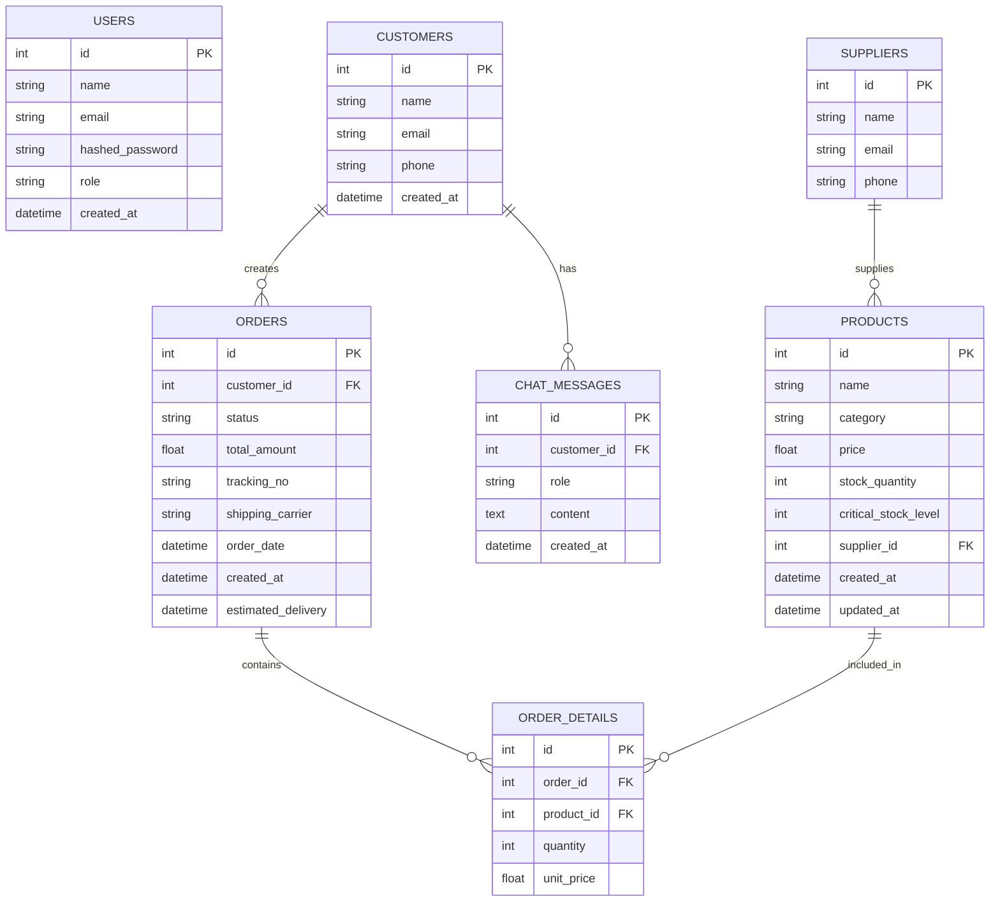

# SMB E-Commerce AI Assistant

## Proje Özeti

Bu proje, KOBİ’lerin e-ticaret operasyonlarını tek bir panel üzerinden daha kolay, hızlı ve verimli şekilde yönetebilmesi için geliştirilmiş yapay zeka destekli bir web uygulamasıdır.

Sistem; ürün yönetimi, sipariş takibi, stok kontrolü, tedarikçi yönetimi, tedarikçi mail taslağı oluşturma ve veritabanına bağlı çalışan AI Assistant özelliklerini bir araya getirir. Böylece küçük işletmeler, günlük operasyonlarını manuel takip etmek yerine merkezi ve akıllı bir yönetim paneli üzerinden kontrol edebilir.

Projenin temel amacı; küçük işletmelerin operasyonel yükünü azaltmak, stok ve sipariş süreçlerini daha görünür hale getirmek, kritik durumlarda hızlı aksiyon alınmasını sağlamak ve yapay zeka desteğiyle karar alma süreçlerini kolaylaştırmaktır.

Uygulamada giriş yapan kullanıcının rolü arayüz üzerinde gösterilir. Kullanıcı rolüne göre bazı butonlar ve işlemler görünür ya da gizlenir. Bu yapı sayesinde frontend tarafında kullanıcı deneyimi iyileştirilirken, backend tarafında rol bazlı yetkilendirme ile güvenli erişim kontrolü sağlanır.

## Çözülen Problem Alanları

Hackathon yönlendirme dokümanındaki 6 alandan **3'üne** odaklandık:

| Alan | Karşılığı |
|------|-----------|
| **1. Müşteri İletişiminin Otomasyonu** | Tool calling tabanlı Gemini agent (`ai/agent.py`) — 4 DB-bağımlı tool ile gerçek veri çeker |
| **2. Ürün ve Sipariş Takibi** | Dashboard + Orders + Suppliers sayfaları, AI-üretilmiş günlük özet |
| **4. Stok ve Envanter Yönetimi** | Inventory sayfası + kritik stok uyarısı + Gemini ile tedarikçi mail taslağı |

## Mimari

```
┌──────────────────────────────────────────────────────────────┐
│                  FastAPI Application (port 8000)             │
│                                                              │
│  Frontend (static)            Backend (JSON API)             │
│  ──────────────────           ─────────────────              │
│  /index.html                  /login, /users (auth)          │
│  /dashboard.html ◀──same-port─/products, /orders             │
│  /products.html               /inventory, /suppliers         │
│  /orders.html                 /dashboard, /chat              │
│  /inventory.html                                             │
│  /suppliers.html              JWT Bearer + RBAC (4 rol)      │
│  /ai-assistant.html                                          │
└─────────────────────────────────┬────────────────────────────┘
                                  │
                  ┌───────────────┼────────────────┐
                  ▼               ▼                ▼
           SQLAlchemy ORM   Google Gemini     ai/ servisleri
              SQLite        (2.0 Flash)       (agent, supplier
            7 tablo         function calling   email, brief)
```

### Klasör yapısı

```
HackathonProject/
├── backend/                  # Backend (FastAPI)
│   ├── main.py               # FastAPI app + CORS + frontend static mount
│   ├── database.py           # SQLite engine + get_db dep
│   ├── models.py             # SQLAlchemy ORM (7 tablo)
│   ├── schemas.py            # Pydantic
│   ├── seed.py               # Demo veri yükleyici
│   ├── routers/              # JSON API endpoint'leri
│   │   ├── auth.py           # JWT + RBAC
│   │   ├── products.py, orders.py, inventory.py
│   │   ├── suppliers.py, dashboard.py, chat.py
│   └── smb_app.db            # SQLite (seed sonrası)
├── ai/                       # AI servisleri
│   ├── agent.py              # Gemini chat agent + tool calling
│   ├── supplier_email.py     # Gemini ile mail taslağı
│   └── dashboard_brief.py    # Gemini ile günlük özet
├── frontend/                 # Frontend (HTML/CSS/JS)
│   ├── *.html (11 sayfa)
│   ├── css/style.css
│   └── js/script.js
├── .env / .env.example
├── .gitignore
├── requirements.txt
└── README.md
```
## Veritabanı Tasarımı / ER Diyagramı
Bu projede veritabanı yapısı 7 ana tablo üzerinden tasarlanmıştır: users, customers, suppliers, products, orders, order_details ve chat_messages.

- Bir müşteri birden fazla sipariş oluşturabilir.
- Bir sipariş, order_details tablosu üzerinden ürün detaylarını içerir.
- Bir tedarikçi birden fazla ürün ile ilişkilendirilebilir.
- Chat mesajları müşteriler ile ilişkilendirilebilir.
- Envanter bilgisi ayrı bir tablo yerine products tablosundaki stock_quantity ve critical_stock_level alanları üzerinden yönetilir.

### ER Diyagramı



## Auth + Role-Based Access Control

### JWT akışı

```
POST /login {email, password}
  ↓
{ access_token: "eyJ...", user: {user_id, name, email, role} }
  ↓
Frontend localStorage'a kaydeder
Tüm sonraki isteklerde header: Authorization: Bearer eyJ...
  ↓
Backend get_current_user decode eder
```

Token süresi: **60 dakika**. Expired olursa frontend 401 alır → otomatik logout.

### Rol matrisi

| Endpoint | Admin | Business Owner | Sales Manager | Inventory Staff |
|---|:-:|:-:|:-:|:-:|
| `GET` (her şey) | ✓ | ✓ | ✓ | ✓ |
| `POST/PUT/DELETE /products` | ✓ | ✓ | ✗ | ✗ |
| `POST /orders`, status, cancel | ✓ | ✓ | ✓ | ✗ |
| `PUT /inventory`, draft-email | ✓ | ✓ | ✗ | ✓ |
| `GET /users` | ✓ | ✓ | ✗ | ✗ |
| `DELETE /users` | ✓ | ✗ | ✗ | ✗ |

Frontend role'a göre menüden Add Product / Add Order butonlarını gizler; backend `require_roles(...)` ile doğrular. **İki katmanlı koruma.**

## AI Entegrasyonu

`ai/` klasörü 3 servis içerir, her biri **AI_ENABLED** flag'ine bağlı:

| Servis | AI_ENABLED=true | AI_ENABLED=false |
|---|---|---|
| `agent.py` | Gemini 2.0 Flash + function calling (4 tool: get_orders/products/inventory/dashboard) | Placeholder mesaj |
| `supplier_email.py` | Gemini ile özelleştirilmiş profesyonel mail | Güvenli şablon |
| `dashboard_brief.py` | Gemini'nin doğal dilde yorumu | Kural-tabanlı özet |

Her servis Gemini hatası durumunda otomatik fallback'a düşer → uygulama asla 500 vermez.

### Tool Calling (agent.py)

```
User mesajı
  ↓
Gemini'ye gönder (4 tool tanımıyla beraber)
  ↓
Gemini "get_inventory tool çağır" der
  ↓
Python tool'u çalıştırır → DB sorgusu → JSON dön
  ↓
Gemini'ye sonucu geri ver
  ↓
Gemini doğal dilde cevap üretir
  ↓
Frontend'e dön (cevap + kullanılan tool listesi)
```

**Multi-tool döngü**: Gemini birden fazla tool'u peş peşe çağırabilir (max 5 iterasyon).

## Hızlı Başlangıç

```powershell
# 1) Bağımlılıklar
cd HackathonProject
python -m venv .venv
.\.venv\Scripts\Activate.ps1
pip install -r requirements.txt

# 2) .env oluştur (.env.example'dan kopyala)
copy .env.example .env
# .env'i editle: GOOGLE_API_KEY=...   AI_ENABLED=false/true

# 3) Veritabanı + örnek veri
python -m backend.seed

# 4) Çalıştır
python -m uvicorn backend.main:app --reload
```

Tarayıcı: **http://127.0.0.1:8000/**
Swagger: **http://127.0.0.1:8000/docs**

## Demo Kullanıcıları

Hepsinin şifresi: `password123`

| Email | Rol |
|---|---|
| `owner@kobi.local` | Admin (her şeyi yapar) |
| `biz@kobi.local` | Business Owner (user silme hariç her şey) |
| `sales@kobi.local` | Sales Manager (sipariş yönetimi) |
| `inventory@kobi.local` | Inventory Staff (stok yönetimi) |

## Demo Senaryoları

### Senaryo 1 — Sabah dashboard'ı (Alan 2)
1. Login: `owner@kobi.local`
2. Dashboard → 5 metrik kartı + **AI Morning Brief** (Gemini'nin doğal dil yorumu)
3. 7 ürün, 4 sipariş, 2 kritik stok görürsün

### Senaryo 2 — Tedarikçi mail otomasyonu (Alan 4)
1. Inventory → kritik stoktaki ürünler (sarı satırlar)
2. **"Draft Email"** tıkla → Gemini'nin özelleştirilmiş mail taslağı modal'da
3. Yönetici onaylar (demo: mail gönderme yok, sadece taslak)

### Senaryo 3 — Sipariş + kargo (Alan 2)
1. Orders → "Add New Order"
2. Müşteri bilgileri + ürün + tarih → submit
3. Listede sipariş, stok düşmüş, estimated_delivery auto (order_date + 3 gün)
4. Satırdaki **"Update"** → status + tracking_no + carrier güncelle

### Senaryo 4 — RBAC canlı (etkileyici)
1. Logout, `sales@kobi.local` ile gir
2. Products → liste görünür ama **"Add New Product" butonu gizli**
3. Inventory → **"Draft Email" butonu gizli**
4. Logout, `inventory@kobi.local` ile gir
5. Orders → **"Update" butonu gizli**

### Senaryo 5 — AI Assistant (function calling)
1. AI Assistant → "Which products are low in stock?"
2. Backend `POST /chat/` → `ai/agent.py` → Gemini → `get_inventory` tool çağrılır
3. Cevap üzerinde **`[tools used: get_inventory]`** etiketi — jüriye "AI gerçekten DB'ye gitti" ispatı

> ⚠ **Quota notu:** Gemini free tier dakikada ~5, modele göre günde 20-1500. Demo öncesi `AI_ENABLED=false` tut, demo sırasında aç.

## Teknoloji Yığını

| Katman | Teknoloji |
|--------|-----------|
| Backend | FastAPI 0.115, Python 3.12 |
| ORM | SQLAlchemy 2.0 |
| DB | SQLite (demo) — Postgres'e taşınabilir |
| Auth | JWT (python-jose) + bcrypt (passlib) + RBAC |
| AI | Gemini 2.0 Flash via `google-genai` SDK + function calling |
| Frontend | Bootstrap 5 + vanilla JS |
| CORS | `fastapi.middleware.cors` |

## API Endpoint Listesi

| Method | Endpoint | Rol |
|---|---|---|
| `GET` | `/health` | public |
| `POST` | `/users` | public |
| `POST` | `/login` | public (JSON — frontend bunu kullanır) |
| `POST` | `/auth/token` | public (OAuth2 form-data — Swagger Authorize butonu için) |
| `GET` | `/me` | auth |
| `GET` | `/users` | Admin/Owner |
| `DELETE` | `/users/{id}` | Admin |
| `GET` | `/products` | her rol |
| `POST` | `/products` | Admin/Owner |
| `PUT` | `/products/{id}` | Admin/Owner |
| `DELETE` | `/products/{id}` | Admin/Owner |
| `GET` | `/orders` | her rol |
| `POST` | `/orders` | Admin/Owner/Sales |
| `PUT` | `/orders/{id}/status` | Admin/Owner/Sales |
| `PUT` | `/orders/{id}/cancel` | Admin/Owner/Sales |
| `GET` | `/inventory` | her rol |
| `PUT` | `/inventory/{product_id}` | Admin/Owner/Inventory |
| `POST` | `/inventory/products/{id}/draft-supplier-email` | Admin/Owner/Inventory |
| `GET` | `/suppliers` | her rol |
| `GET` | `/suppliers/{id}` | her rol |
| `GET` | `/dashboard` | her rol |
| `POST` | `/chat/` | public (müşteri chat) |

Toplam: **22 endpoint** (FastAPI auto `/docs`, `/openapi.json`, `/redoc` hariç)

## Sınırlamalar (Demo Sürümü)

- Mail göndermez, taslak gösterir (gerçek SMTP entegrasyonu eklenebilir)
- Kargo entegrasyonu simüle: `Order.status` + `tracking_no` manuel set ediliyor
- Containerization yok — yerel uvicorn ile çalışır
- Production için: HTTPS + secret rotasyonu + rate limit + Postgres geçişi
